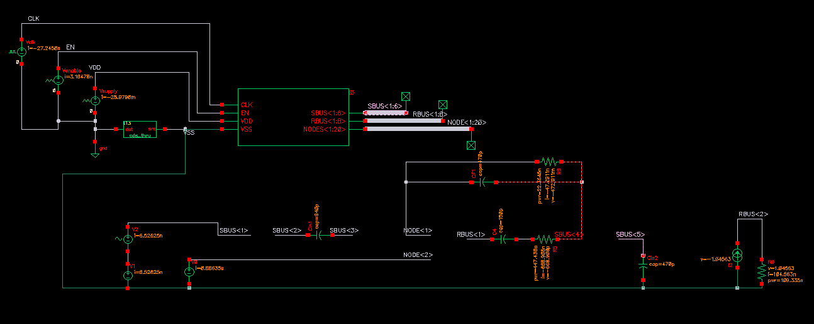
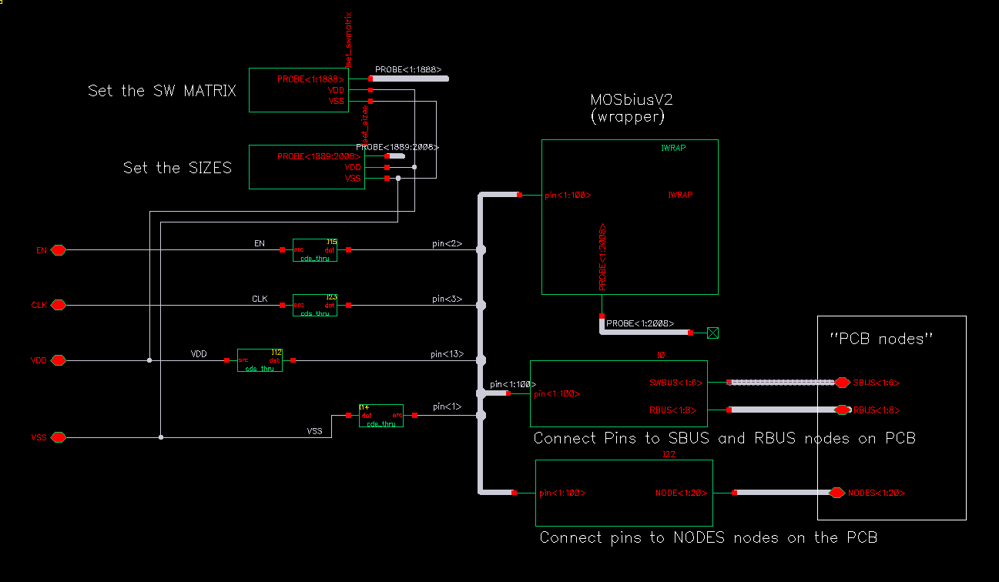

# MOSbiusV2Tools

Tools for supporting the simulation of the MOSbiusV2. 

## Overview
MOSbiusV2Tools is a Python package that provides command-line tools for generating SPICE subcircuits from JSON circuit descriptions and sizing files. It facilitates the mapping of circuit components to switch matrix pins and registers, enabling efficient simulation of the MOSbiusV2 chip.

## Installation

### Quick Setup with Virtual Environment (Recommended)

```bash
# Create a virtual environment
python -m venv venv-mosbiusv2tools

# Activate the virtual environment
source venv-mosbiusv2tools/bin/activate.csh  # for a tcsh

# Install `mosbiusv2tools` directly from GitHub
pip install git+https://github.com/peterkinget/MOSbiusV2Tools.git

rehash # for a tcsh
```

### Alternative Installation Methods

Install from source:

```bash
git clone https://github.com/peterkinget/MOSbiusV2Tools.git
cd MOSbiusV2Tools
pip install .
```

### Verifying Installation

<THIS DOES NOT WORK - IGNORE>

Run the test script to verify your installation:

```bash
python -m commandline.test_installation
```

## Command-line Tools

The package provides four main command-line tools:

1. **`generate_sizes_probe_subckt`** - Generates a SPICE subcircuit file for the **PK_set_sizes_2** cell in the **PK_utils** category in the cadence library; it sets the device sizes.
2. **`generate_switch_matrix_probe_subckt`** - Generates a SPICE subcircuit file for the **PK_set_SWMATRIX** cell in the **PK_utils** category in the cadence library; it sets the PROBE connections that control the switch matrix.
2. **`generate_pins_to_RBUS_SBUS_subckt`** - Generates a SPICE subcircuit file for the **PK_pins_to_RBUS_SWBUS** cell in the **PK_utils** category in the cadence library; it connects chip pins to RBUS and SBUS "PCB" nodes for easy observation.
4. **`generate_nodes_subckt`** - Generates a SPICE subcircuit file for the **PK_NODE_external_connections** cell in the **PK_utils** category in the cadence library; it connects chip pins to NODE "PCB" nodes for easy observation.

## Usage

Example JSON files are found in the `examples` directory in the repository. The format is described below.

### Device Sizing

```bash
generate_sizes_probe_subckt examples/all_transistors_4x_sizes.json output_sizes_spice.cir
```

### Switch Matrix Configuration

```bash
generate_switch_matrix_probe_subckt examples/INV_string_clocked_RBUS_SBUS.json output_switch_matrix_spice.cir
```

### Connecting Pins to NODE Nodes

```bash
generate_nodes_subckt examples/INV_string_12_NODE.json output_nodes_spice.cir
```
### Connecting Pins to RBUS and SBUS

```bash
generate_pins_to_RBUS_SBUS_subckt examples/INV_string_5_RBUS.json output_rbus_sbus_spice.cir
```

You can now use these *spice subckts* to define different 'Spice' versions of the cells which you can select using the *config editor* in Cadence to simulate different circuits. Take a look at the *PK_die_wrapper_everything* for an example that uses all cells and subcircuits. 

### Example Schematics

#### Top Level

This is a top-level schematic for the switched-capacitor amplifier test bench using the *PK_die_wrapper_everything* cell and adding the external components, supplies, control signals, and bias. 



#### PK_die_wrapper_everything cell


The four subckts are instantiated here. Using the *MOSbiusV2Tools* scripts you can generate the necessary *spiceText subckt* descriptions from your `circuit.json` (see below).

## Circuit Description

Create a `.json` file to describe the circuit connectivity that the on-chip switch matrices *RBUS* and *SBUS* or the external *NODES* needs to implement. 

All terminals of the devices are connected to pins of the chip. The pin mappings are defined in the `pin_name_to_sw_matrix_pin_number.json` file, located in the `commandline/chip_config_data/` directory:

```json
{
    "internal_A": "internal_A",
    "internal_B": "internal_B",
    "internal_C": "internal_C",
    "internal_D": "internal_D",
    "VSS": 92.0,
    "DCC1_P_D_L_CC": 1.0,
    "DCC1_P_D_R_CS": 11.0,
    "DCC1_P_D_R_CC": 12.0,
    "VDD": 13.0,
    "DINV1_INP_L": 14.0,
    "DINV1_INN_L": 15.0,
    "DINV1_OUT_L": 16.0,
    "DINV1_INP_R": 17.0,
    "DINV1_INN_R": 18.0,
    "DINV1_OUT_R": 19.0,
    "DINV2_INP_L": 20.0,
    "DINV2_INN_L": 21.0,
    "DINV2_OUT_L": 22.0,
    "DINV2_INP_R": 23.0,
    "DINV2_INN_R": 24.0,
    "DINV2_OUT_R": 25.0,
    "DCC4_P_G_L_CC": 26.0,
    "DCC4_P_G_L_CS": 27.0,
    "DCC4_P_G_R_CC": 28.0,
    "DCC4_P_G_R_CS": 29.0,
    "DCC4_P_D_L_CC": 30.0,
    "DCC4_P_D_L_CS": 31.0,
    "DCC4_P_D_R_CC": 32.0,
    "DCC4_P_D_R_CS": 33.0,
    "OTA_P_INP": 34.0,
    "OTA_P_INN": 35.0,
    "OTA_P_OUT": 36.0,
    "CC_N_G_CC": 37.0,
    "CC_N_G_CS": 38.0,
    "CC_N_D_CC": 39.0,
    "CC_N_D_CS": 40.0,
    "DCC2_N_G_L_CC": 41.0,
    "DCC2_N_G_L_CS": 42.0,
    "DCC2_N_G_R_CC": 43.0,
    "DCC2_N_G_R_CS": 44.0,
    "DCC2_N_D_L_CC": 45.0,
    "DCC2_N_D_L_CS": 46.0,
    "DCC2_N_D_R_CC": 47.0,
    "DCC2_N_D_R_CS": 48.0,
    "DCC3_N_G_L_CC": 49.0,
    "DCC3_N_G_L_CS": 50.0,
    "DCC3_N_G_R_CC": 51.0,
    "DCC3_N_G_R_CS": 52.0,
    "DCC3_N_D_L_CC": 53.0,
    "DCC3_N_D_L_CS": 54.0,
    "DCC3_N_D_R_CC": 55.0,
    "DCC3_N_D_R_CS": 56.0,
    "DCC3_P_G_L_CS": 57.0,
    "DCC3_P_G_L_CC": 58.0,
    "DCC3_P_G_R_CS": 59.0,
    "DCC3_P_G_R_CC": 60.0,
    "DCC3_P_D_L_CS": 61.0,
    "DCC3_P_D_L_CC": 62.0,
    "DCC3_P_D_R_CS": 63.0,
    "DCC3_P_D_R_CC": 64.0,
    "DCC1_N_G_L_CC": 65.0,
    "DCC1_N_G_L_CS": 66.0,
    "DCC1_N_G_R_CC": 67.0,
    "DCC1_N_G_R_CS": 68.0,
    "DCC1_N_D_L_CC": 69.0,
    "DCC1_N_D_L_CS": 70.0,
    "DCC1_N_D_R_CC": 71.0,
    "DCC1_N_D_R_CS": 72.0,
    "DCC2_P_G_L_CS": 73.0,
    "DCC2_P_G_L_CC": 74.0,
    "DCC2_P_G_R_CS": 75.0,
    "DCC2_P_G_R_CC": 76.0,
    "DCC2_P_D_L_CS": 77.0,
    "DCC2_P_D_L_CC": 78.0,
    "DCC2_P_D_R_CS": 79.0,
    "DCC2_P_D_R_CC": 80.0,
    "OTA_N_INP": 81.0,
    "OTA_N_INN": 82.0,
    "OTA_N_OUT": 83.0,
    "CC_P_G_CS": 84.0,
    "CC_P_G_CC": 85.0,
    "CC_P_D_CS": 86.0,
    "CC_P_D_CC": 87.0,
    "DCC4_N_G_L_CC": 88.0,
    "DCC4_N_G_L_CS": 89.0,
    "DCC4_N_G_R_CC": 90.0,
    "DCC4_N_G_R_CS": 91.0,
    "DCC4_N_D_L_CC": 92.0,
    "DCC4_N_D_L_CS": 93.0,
    "DCC4_N_D_R_CC": 94.0,
    "DCC4_N_D_R_CS": 95.0,
    "DCC1_P_G_L_CS": 96.0,
    "DCC1_P_G_L_CC": 97.0,
    "DCC1_P_G_R_CS": 98.0,
    "DCC1_P_G_R_CC": 99.0,
    "DCC1_P_D_L_CS": 100.0
}
```

### Regular-Bus Connections

There are 8 regular buses, "RBUS1" thru "RBUS8"; the `.json` circuit file describes which device terminals connect to each
```
{
    "RBUS1": ["DINV2_INP_L", "DINV2_INN_L"],
    "RBUS2": ["DINV2_OUT_L", "DINV2_INP_R", "DINV2_INN_R"],
    "RBUS3": ["DINV2_OUT_R", "DINV1_INP_L", "DINV1_INN_L"],
    "RBUS4": ["DINV1_OUT_L", "DINV1_INP_R", "DINV1_INN_R"], 
}
```
### Switched-Bus Connections

There are 6 switched buses, "SBUS1 thru "SBUS6"; these buses can make a permanent connection to a terminal "ON", or a clocked connection using non-overlapping clock phases "PHI1" or "PHI2".
```
{
    "RBUS1": ["CC_N_G_CC", "CC_P_G_CC"],
    "RBUS2": ["CC_N_D_CC", "CC_P_D_CC"],
    "RBUS7": ["VSS", "CC_P_G_CS"],
    "RBUS8": ["VDD", "CC_N_G_CS"],
    "SBUS1": [
        {"terminal": "DINV1_INP_L", "connection": "ON"},
        {"terminal": "DINV1_INN_L", "connection": "ON"},
        {"terminal": "CC_N_D_CC", "connection": "PHI1"}
    ],
    "SBUS2": [
        {"terminal": "DINV1_INP_R", "connection": "ON"},
        {"terminal": "DINV1_INN_R", "connection": "ON"},
        {"terminal": "DINV1_OUT_L", "connection": "PHI2"}
    ],
    "SBUS3": [
        {"terminal": "DINV2_INP_L", "connection": "ON"},
        {"terminal": "DINV2_INN_L", "connection": "ON"},
        {"terminal": "DINV1_OUT_R", "connection": "PHI1"}
    ],
    "SBUS4": [
        {"terminal": "DINV2_INP_R", "connection": "ON"},
        {"terminal": "DINV2_INN_R", "connection": "ON"},
        {"terminal": "DINV2_OUT_L", "connection": "PHI2"}
    ]
}
```

One `circuit.json` file contains the whole circuit connections description for the RBUSes and the SBUSes as shown above. 

### Internal BUSes

There are four internal buses `internal_A` thru `internal_D`. They can be used like pins in the `terminal` declarations, however they are not connected to the outside world. They main targeted use is to connect to an "SBUS" so that switched connections can be made between SBUSes that are not connected to other pins. 

### Everything

Below is the example of a switched capacitor integrator circuit that uses all BUSes, internal pins, and external NODE connections; the NODE connections just facilitate the simulation setup and do not require you to use particular `pin<>` numbers:

```json
{
    "NODE<1>": [
	"OTA_N_INP"
    ],
    "NODE<2>": [
	"OTA_N_INN"
    ],
    "NODE<3>": [
	"CLK"
    ],
    "RBUS1": [
	"OTA_N_OUT",
	"DINV1_INP_L"
    ],
    "RBUS2": [
	"CC_N_G_CS",
	"CC_N_D_CC",
	"DINV1_INN_L"
    ],
    "RBUS8": [
	"VDD", 
	"CC_N_G_CC"
    ],
    "SBUS1": [
	{"terminal": "internal_A", "connection": "ON"}
    ], 
    "SBUS2": [
        {"terminal": "OTA_N_INN", "connection": "PHI2"},
        {"terminal": "internal_A", "connection": "PHI1"}
    ],
    "SBUS3": [
        {"terminal": "OTA_N_INP", "connection": "PHI2"},
        {"terminal": "OTA_N_INN", "connection": "PHI1"}
    ],
    "SBUS4": [
        {"terminal": "DINV1_OUT_L", "connection": "ON"},
        {"terminal": "OTA_N_INP", "connection": "PHI1"},
        {"terminal": "internal_B", "connection": "PHI2"}
    ],
    "SBUS5": [
        {"terminal": "internal_B", "connection": "ON"}
    ]

}
```

### Transistor Sizing

Create a separate `.json` file with the sizing for all the devices; here is an empty file:
```
{
    "CC_N": [],
    "CC_P": [],
    "DCC1_N_L": [],
    "DCC1_N_R": [],
    "DCC1_P_L": [],
    "DCC1_P_R": [],
    "DCC2_N_L": [],
    "DCC2_N_R": [],
    "DCC2_P_L": [],
    "DCC2_P_R": [],
    "DCC3_N_L": [],
    "DCC3_N_R": [],
    "DCC3_P_L": [],
    "DCC3_P_R": [],
    "DCC4_N_L": [],
    "DCC4_N_R": [],
    "DCC4_P_L": [],
    "DCC4_P_R": [],
    "DINV1_L": [],
    "DINV1_R": [],
    "DINV2_L": [],
    "DINV2_R": [],
    "OTA_N": [],
    "OTA_P": []
}
``` 
Fill in the sizes `0, 1, 2, ... 31` for the respective devices in the file. If you omit a device the size will be set to `0`. Here is an example of a sizing file: 
```
{
    "CC_N": [1],
    "CC_P": [1],
    "DCC1_N_L": [5],
    "DCC1_N_R": [5],
    "DCC1_P_L": [5],
    "DCC1_P_R": [5],
    "DCC2_N_L": [7],
    "DCC2_N_R": [7],
    "DCC2_P_L": [7],
    "DCC2_P_R": [7],
    "DCC3_N_L": [9],
    "DCC3_N_R": [9],
    "DCC3_P_L": [9],
    "DCC3_P_R": [9],
    "DCC4_N_L": [11],
    "DCC4_N_R": [11],
    "DCC4_P_L": [11],
    "DCC4_P_R": [11],
    "DINV1_L": [13],
    "DINV1_R": [13],
    "DINV2_L": [15],
    "DINV2_R": [15],
    "OTA_N": [1],
    "OTA_P": [1]
}
```

## Example Files

The repository contains various example JSON files in the `mosbiusv2tools_examples` directory:

- **Circuit Configurations:**
  - `INV_string_12_NODE.json` - First example using NODE connections, i.e. **no** on-chip BUSes are used, all connections are made externally. When you connect the input to the output of an odd stage you get a ring oscillator. 
  - `INV_string_11_CC_RBUS_SBUS.json` - Inverter string using on-chip RBUS and static SBUS connections, which you can use to make a ring oscillator by making an external connection.
  - `INV_string_clocked_RBUS_SBUS.json` - Circuit with a series of four inverters but connected to each other switched clocks; it uses RBUS and switched SBUS connections
  - `sw_cap_OTA_N_DINV1_L_NODE_RBUS_SBUS.json` - Switched capacitor amplifier using a two-stage OTA and on-chip switches and external capacitors; it uses RBUSes, switched SBUSes, internal pins, and external connections via NODES to realize and observe the circuit. 

- **Device Sizing:**
  - `empty_device_name_sizes.json` - Template for new size configurations
  - `all_transistors_4x_sizes.json` - Example device sizing file
  - `INV_string_12_growing_sizes.json` - Example with progressively increasing transistor sizes
  - `OTA_N_DINV1_L_sizes.json` - Sizes that can be used for the switched capacitor example
## File Structure

The project includes several important directories. Assuming you are using the `venv` with the name `venv-mosbiusv2tools` installed in your home directory `~`, the files are in the following folders; you can find the files in the GitHub repo easily as well. 
- `~/venv-mosbiusv2tools/mosbiusv2tools_examples/` - Contains example JSON files for device sizing and circuit configurations
- `~/venv-mosbiusv2tools/lib/python3.13/site-packages/commandline/` - Main package directory containing Python scripts (adjust name based on your python version) and with the following subfolders. 
  - `chip_config_data/` - JSON files mapping pins to switch matrix positions
  - `src/` - Source code for the command-line tools


## License

This project is licensed under the MIT License.